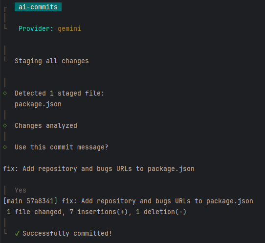

# AI Commits 🤖📝

Intelligent commit message generator using different AI providers

<div>
  <div>
    
  </div>
</div>

## Key Features
- ✅ Supports multiple AI providers (Gemini, OpenAI, and more)
- 🔧 Simple CLI configuration
- 🌍 Multi-language support (English, Portuguese, and others)
- 💡 Context-aware message generation
- 📦 Modular and extensible architecture

## Installation

```bash
# Global install
npm install -g @elielelie/ai-commits

# via npx
npx ai-commits
```

## Configuration

```bash
# Set AI provider
aicommits --provider=gemini

# Set API keys
aicommits --gemini-key=your_key_here

# Other configurations
aicommits --locale=en

```

## Supported Providers

|Provider	| Default Model	       |Environment Variable|
|----------|----------------------|--------------------|
|Gemini	| gemini-1.5-flash	 |GEMINI_KEY|
|OpenAI	| gpt-3.5-turbo	       |OPENAI_KEY|

## Usage

```bash
# Commit with staged files
aicommits
# or 
aic # alias

# Commit including all modified files
aicommits --all

# Commit including one modified files
aicommits --file <file_path>

# Specify provider
aicommits --provider=gemini

# Specify model
aicommits --model=gemini-1.5-flash

# Dry message
aicommits --dry

```

## Provider Configuration

### Google Gemini

1. Obtain an API Key from [Google AI Studio](https://aistudio.google.com/).

2. Configure it:

```bash
aicommits --provider=gemini
aicommits --gemini-key=your_key
```

### OpenAI

1. Obtain an API Key from [OpenAI Dashboard](https://platform.openai.com/).

2. Configure it:

```bash
aicommits --provider=openai
aicommits --openai-key==your_key
```

### Where is my API key stored?

Credentials are stored locally at ```~/.ai-commits```


** The inspiration for this project was based on [Nutlope/aicommits](https://github.com/Nutlope/aicommits).